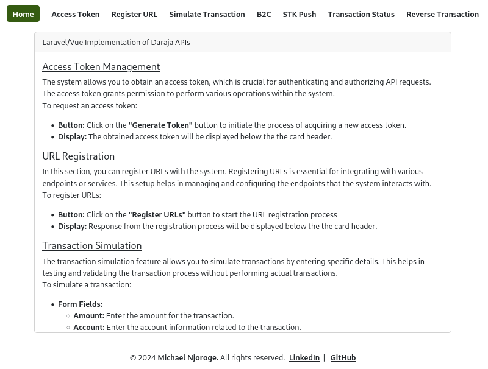
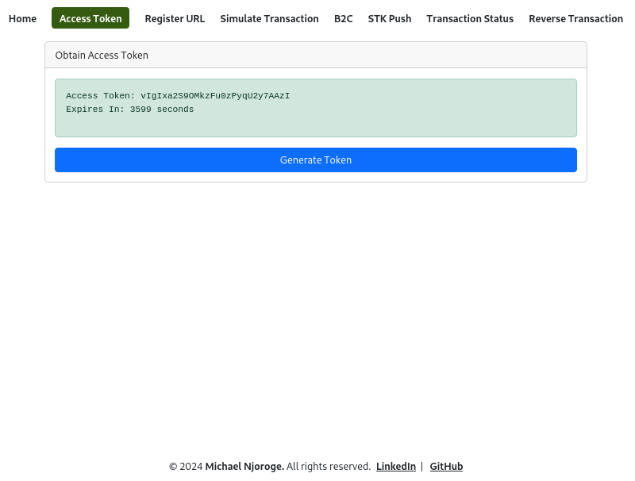
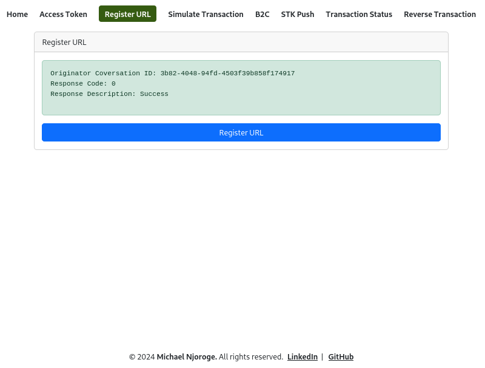
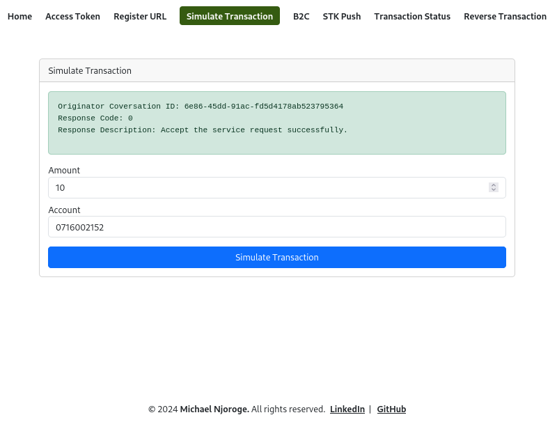
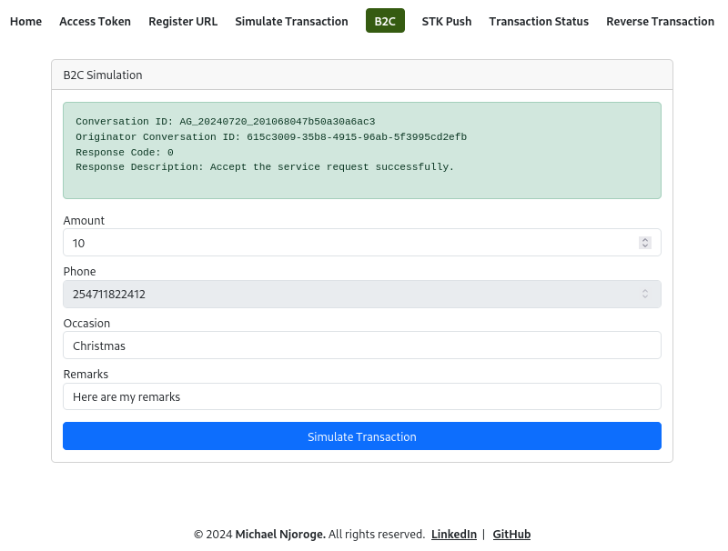
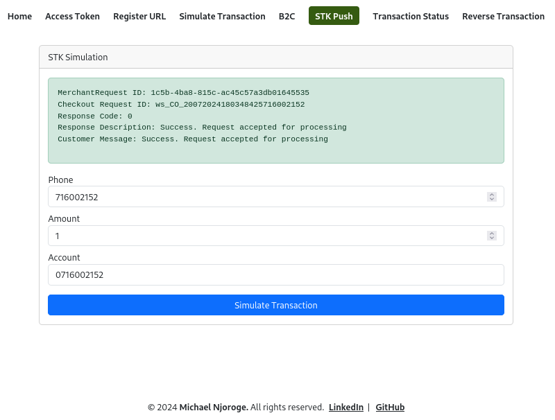
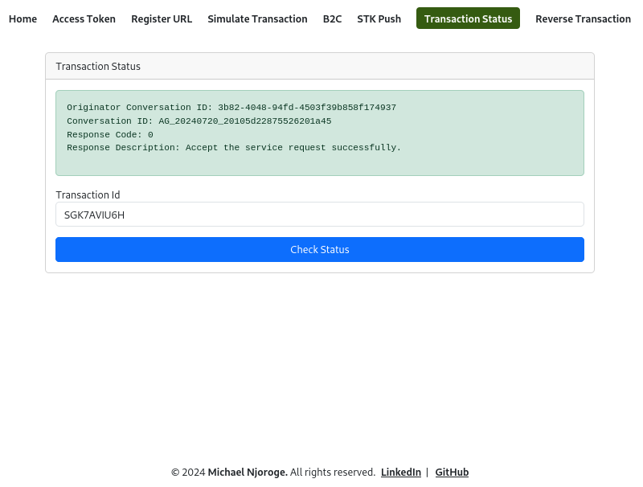
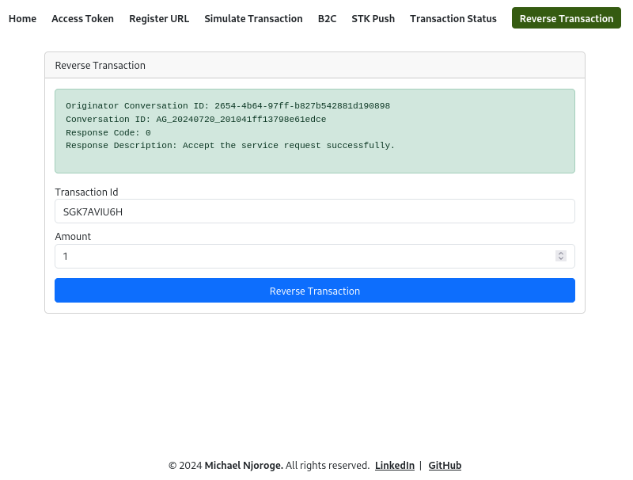

# Mpesa STK Frontend

## Home Page

*Description: The home page of the Mpesa STK frontend, showing an overview of the available features and options.*

## Obtain Access Token

*Description: The page where users can obtain an access token by clicking the 'Generate Token' button.*

## Register URL

*Description: The interface for registering URLs for Mpesa transactions, including validation and submission fields.*

## Simulate Transaction

*Description: The simulation page for conducting test transactions, with input fields for amount, phone number, and account details.*

## B2C Simulation

*Description: The B2C (Business to Customer) simulation page, allowing users to simulate business-to-customer transactions.*

## STK Simulation

*Description: The STK (Sim Tool Kit) simulation page, where users can simulate STK push requests and receive prompts on their phones.*

## Transaction Status

*Description: The transaction status page, displaying the status of recent transactions including success and failure messages.*

## Reverse Transaction

*Description: The interface for reversing transactions, allowing users to input transaction details and initiate reversals.*
